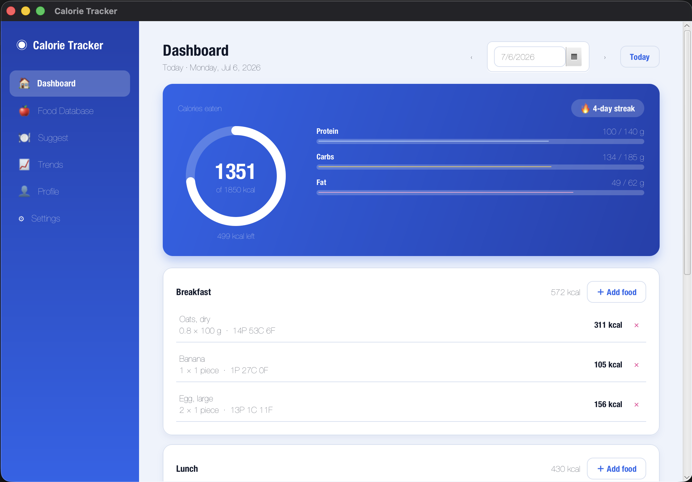
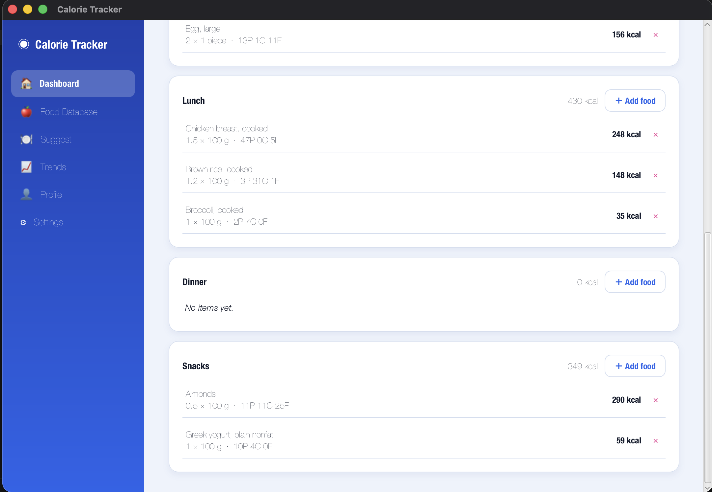
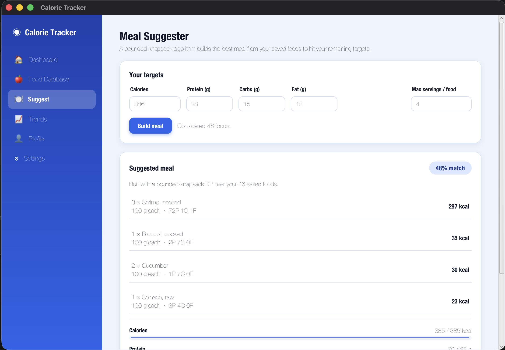
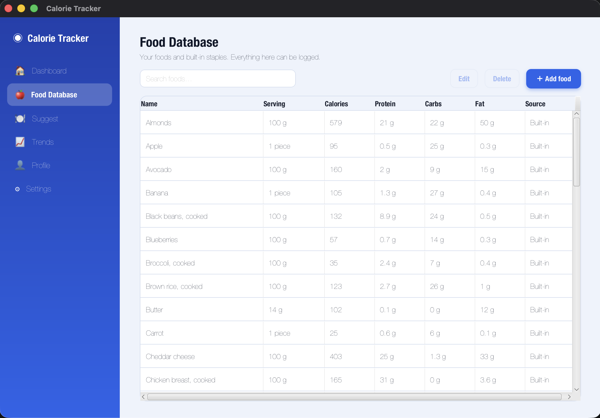
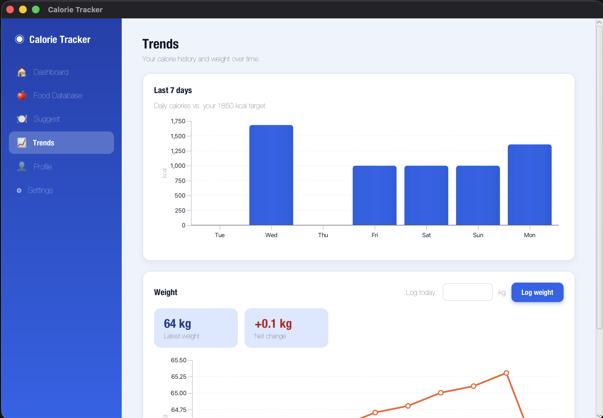
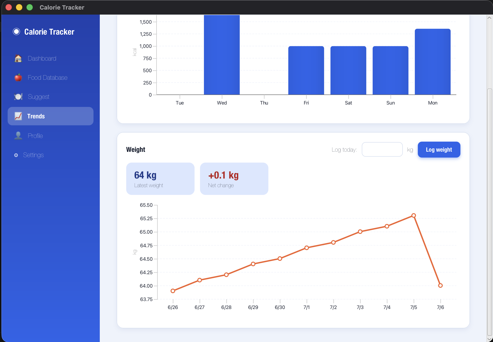
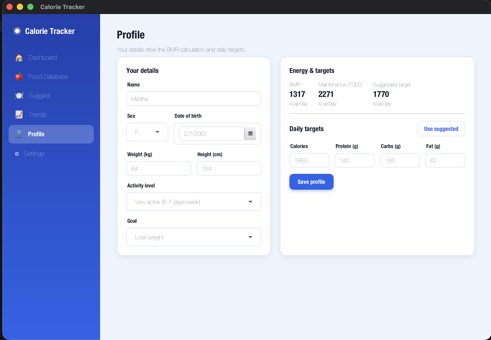
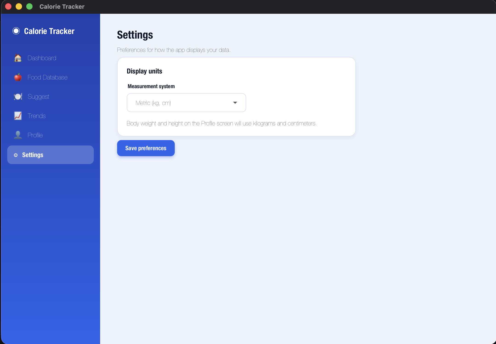

# Calorie Tracker

A desktop app for tracking calories and macros, built with **JavaFX 25** and **SQLite**.

## Screenshots

<table>
  <tr>
    <td></td>
    <td></td>
  </tr>
  <tr>
    <td align="center"><sub>Dashboard: calorie ring, streak, macro bars</sub></td>
    <td align="center"><sub>Dashboard: meals logged by section</sub></td>
  </tr>
  <tr>
    <td></td>
    <td></td>
  </tr>
  <tr>
    <td align="center"><sub>Meal Suggester: knapsack-built meal</sub></td>
    <td align="center"><sub>Food Database: searchable, editable</sub></td>
  </tr>
  <tr>
    <td></td>
    <td></td>
  </tr>
  <tr>
    <td align="center"><sub>Trends: last 7 days of calories</sub></td>
    <td align="center"><sub>Trends: weight over time</sub></td>
  </tr>
  <tr>
    <td></td>
    <td></td>
  </tr>
  <tr>
    <td align="center"><sub>Profile: BMR, TDEE, and targets</sub></td>
    <td align="center"><sub>Settings: metric / imperial toggle</sub></td>
  </tr>
</table>

## Features

- **BMR & calorie targets:** Mifflin–St Jeor BMR, activity-based TDEE, and a goal-adjusted daily
  calorie target with a suggested 30/40/30 macro split (all editable).
- **Daily food logging by meal:** Breakfast / Lunch / Dinner / Snacks, with a date navigator to
  review any day.
- **Macro tracking:** a calorie progress ring and protein/carbs/fat bars toward your daily targets,
  plus a logging streak counter.
- **Algorithmic Meal Suggester:** enter remaining calories and macros, and a bounded-knapsack
  dynamic program picks the best combination of your saved foods to hit them, with one click to log it.
- **Trends:** a 7-day calorie bar chart against your target, and a weight-over-time line chart with
  quick weight logging.
- **Custom food database:** full create/edit/delete, searchable, pre-seeded with ~45 common foods.
- **Metric or imperial:** toggle in Settings; body metrics are stored canonically in metric and
  converted for display.

Data is stored locally in `~/.calorietracker/data.db`.

## Requirements

- Java 21+ (developed and tested on Temurin 25)
- Maven (`brew install maven`)

## Run

```bash
mvn javafx:run
```

## Test

```bash
mvn test
```

## Build

```bash
mvn clean package
```

Generates the runnable build in `target/`.

```bash
mvn clean verify
```

Generates the distributable package (installer) in `target/dist/`.

## Project structure

```
src/main/java/com/calorietracker/
  App.java                  Sidebar shell + view navigation
  model/                    Domain types (Food, FoodLogEntry, UserProfile, WeightEntry, enums)
  db/                       Database (schema init + seeding) and JDBC DAOs
  service/                  BmrCalculator, UnitConverter, NutritionService, StreakService, MealSuggester
  ui/                       AppContext, dialogs, custom controls (CalorieRing), and FXML controllers
src/main/resources/
  fxml/                     Dashboard, Food Database, Suggest, Trends, Profile, Settings views
  css/app.css               Design system (colors, cards, sidebar, macro bars, charts)
  db/                       schema.sql, seed_foods.sql
docs/screenshots/           README screenshots
```
